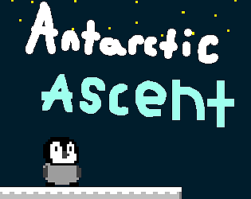

# Antarctic Ascent

Help the little penguin reach for the stars by helping it achieve its dreams of flying in the sky through building blocks to ascend.
Collect snowflakes to place blocks and erase them to regain some snow.

### Made for the GMTK 2024 Game Jam
**Theme:** "Built to Scale"

**[Play on itch.io](https://jigglyjello.itch.io/antarctic-ascent)**

---

## Controls
* **Jump:** `W` or `Up`
* **Move Left:** `A` or `Left`
* **Move Right:** `D` or `Right`
* **Place Block:** `Left Click` *(Hold to place continuously)*
* **Erase Block:** `Right Click` *(Hold to erase continuously)*

## Built With
* **Engine:** [Godot 4.3](https://godotengine.org/license/)
* **Language:** GDScript

## Licenses
* **Source/ (Game Logic & Structure):** Licensed under the [GNU General Public License v3.0 or later](LICENSE).
* **Assets/ (Creative Media):**
  * **Sprites and Images:** Licensed under [CC BY-SA 4.0](https://creativecommons.org/licenses/by-sa/4.0/).
  * **Font:** The *Press Start 2P* font is licensed under the [SIL Open Font License 1.1 (OFL)](https://fonts.google.com/specimen/Press+Start+2P/license).
  * **Audio:** All sound effects and music are third-party assets (Public Domain/CC0). See the appropriate credits files for full details, specific licenses, and original sources.